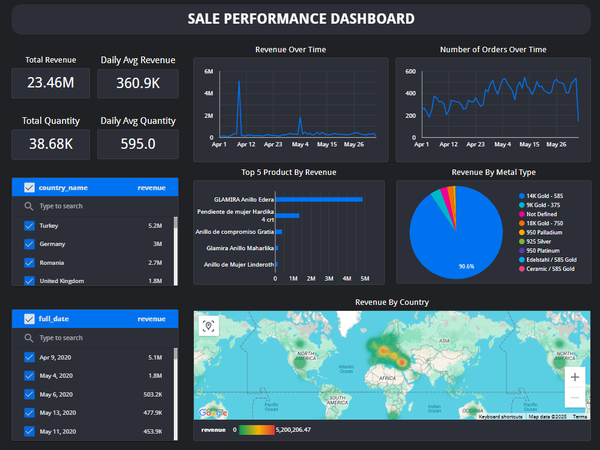

# Glamira E-commerce Analytics Pipeline Project

## Table of Contents
- [Glamira E-commerce Analytics Pipeline Project](#glamira-e-commerce-analytics-pipeline-project)
  - [Table of Contents](#table-of-contents)
  - [Data Collection \& Storage Foundation](#data-collection--storage-foundation)
    - [❓ Problem Description](#-problem-description)
    - [🎯 Learning Objectives](#-learning-objectives)
    - [📋 Preparation](#-preparation)
      - [**1. Environment Setup**](#1-environment-setup)
      - [**2. Access management**](#2-access-management)
      - [**3. Google Cloud Storage Setup**](#3-google-cloud-storage-setup)
      - [**4. Virtual Machine and Mongodb Setup**](#4-virtual-machine-and-mongodb-setup)
      - [**5. Initial Data Loading**](#5-initial-data-loading)
    - [📝 Tasks](#-tasks)
      - [**1. IP Location Processing**](#1-ip-location-processing)
      - [**2. Product Data Processing**](#2-product-data-processing)
  - [Data Pipeline \& Storage](#data-pipeline--storage)
    - [❓ Problem Description](#-problem-description-1)
    - [🎯 Learning Objectives:](#-learning-objectives-1)
    - [📝 Tasks](#-tasks-1)
      - [**1. Export crawled data and raw behaviour data into GCS**](#1-export-crawled-data-and-raw-behaviour-data-into-gcs)
      - [**2. Load data from GCS to Bigquery**](#2-load-data-from-gcs-to-bigquery)
  - [Visualization](#visualization)
    - [❓ Problem Description](#-problem-description-2)
    - [🎯 Learning Objectives](#-learning-objectives-2)
    - [📝 Tasks](#-tasks-2)
      - [**Data Visualization**](#data-visualization)
  - [📝 How to set up and run](#-how-to-set-up-and-run)
  - [🚀 Future Enhancements](#-future-enhancements)


## Data Collection & Storage Foundation

### ❓ Problem Description
Based on the given mongodb-based database with the Consumer behavior of GLAMIRA
- Collecting, storing, and processing data including IP address and product information by using **Google Cloud Platform (GCP)**, **MongoDB**, and **Python**.
- The project also involves IP geolocation enrichment, product data crawling.


### 🎯 Learning Objectives
- Understand cloud infrastructure setup with GCP.
- Work with **Google Cloud Storage (GCS)** and **VM instances**.
- Perform basic data processing using **Python**.
- Load and query data with **MongoDB**.
- Implement **IP geolocation** using `ip2location-python` library.
- Crawl product information.
- Conduct basic **data profiling** and documentation.


### 📋 Preparation

#### **1. Environment Setup**
- Create a **GCP account** and project.
- Understand basic GCP concepts: projects, billing, IAM.
- Download **Glamira dataset**


#### **2. Access management**
- Access IAM on GCP
  => Service account
  => Create service account
  => Set service account ID
  => Set permission for the service account - should add role owner for all permission
  => Choose Action => Manage keys => Add key => Create new key => json file to download
- Reference to connect python with VM GCP: [Stackoverflow](https://stackoverflow.com/questions/51554341/google-auth-exceptions-defaultcredentialserror)


#### **3. Google Cloud Storage Setup**
- Create **GCS bucket** for raw data.
- Understand storage classes.
- Configure authentication and service accounts.
- Upload raw dataset to the bucket.

#### **4. Virtual Machine and Mongodb Setup**
- Create a **VM instance** in GCP.
- Install **MongoDB** on the VM. Reference [Mongodb](https://www.mongodb.com/docs/manual/tutorial/install-mongodb-on-ubuntu/)
- Test database connectivity.
- Configure VM GCP
  - Create network tag for VM
  - Create new firewall rule for TCP 27017 => choose specific network tag VM => set specific IP address to connect with Mongodb through VM GCP (prefer /32 to ensure the security)
- Configure Mongodb on VM
  - sudo vim /etc/mongod.conf
  - Change bindIP into 0.0.0.0
  - security
    authorization: enabled
- Create user and password for mongodb
  - mongosh
  - use admin
  - db.createUser({
    user: "user_name",
    pwd: "password",
    roles: [ { role: "readWrite", db: "database_name" } ]
  })

#### **5. Initial Data Loading**
- Import raw dataset into **MongoDB**.
  - Transfer data from GCS bucket to VM instance: `sudo gsutil -m cp gs://file_path destination_path`
  - Restore bson file, which is already downloaded from preparation 1
- Run basic MongoDB queries to explore data.
- Document the data structure:
  - **Collections and fields**.
  - **Data dictionary**.

### 📝 Tasks
#### **1. IP Location Processing**
- Collect all IP addresses interacting with GLAMIRA website
- Write a Python script to:
  1. Connect to MongoDB.
  2. Retrieve unique IPs from the main collection.
  3. Use **IP2Location** to enrich data with geolocation.
  4. Save results into a new collection.

#### **2. Product Data Processing**
- Filter events (collection in the document in Mongodb database) and extract `product_id` (or `viewing_product_id`) and `current_url` for
  `view_product_detail`, `select_product_option`, `select_product_option_quality`,
  `add_to_cart_action`, `product_detail_recommendation_visible`,
  `product_detail_recommendation_noticed`.
- Filter events and extract `viewing_product_id` and `referrer_url` for `product_view_all_recommend_clicked`
- For collection product_view_all_recommend_clicked, creating index
```db.summary.createIndex({ collection: 1, viewing_product_id: 1, referrer_url: 1 })```
- For remaining collection, creating index
```db.summary.createIndex({ collection: 1, product_id: 1, current_url: 1 })```
```db.summary.createIndex({ collection: 1, viewing_product_id: 1, current_url: 1 })```
- Write a Python script to crawl the **product information** using `referrer_url` or `current_url`

**2.1 Filter event and extract product_id, url**
- Group by pid and url and get all.
- Then create set() and assign urls corresponding to pid.
- Convert urls to list and save to json file

**2.2 Crawling product information based on pid, url and domain**
- Crawl all the information of different links and save it to json as suffix
- For example: pid: 10000, "com": ....................., "co.uk": ....................

**Note: Improve performance for crawling data**

**Merge pid and url from filters**
- Cover all pid and url into one file:
  - Collect unique url through all filters
  - If there exists "checkout" in url, it will be removed
  - If Subdomain of url is not "www", it will be removed

**Select appropriate approach for crawling**
- Option 1: Sequencing: the lowest approach
- Option 2: Multiprocessing: faster than sequencing, but puts a burden on the CPU and is prone to IP blocking
- Option 3: Multiprocessing combined with Multithreading and Proxies: High performance, but it is exorbitant for high quality rotating residential proxies
- Option 4: Asynchronous: Fast, stable, rarely blocked IP with suitable semaphore

  => In this project, its better to use Async with the package product_enrichment

**Collecting product data for an url**
- With 404 error url, return error and stop retrying
- With 403 forbidden error url, return error and stop retrying
- With 429 error url due to too many requests, wait with random seconds and retry, after 3 attempts, return error

**Collecting product data for a product_id**
  - Collect errors within 10s, after 10s or when there are 50 errors, save errors once
  - When a product_id with an url of a specific domain has been crawled, so the domain process function will return result and stop all other url. For example, if ".com" has been crawled, it return data and stop function for the domain ".com"


## Data Pipeline & Storage

### ❓ Problem Description
Based on the data from DATA COLLECTION part
- Export data to GCS
- Create trigger to load all raw data from GCS to Bigquery

### 🎯 Learning Objectives:
- Understanding ETL processes
- Working with Google Cloud Storage
- Implementing automated triggers
- Basic BigQuery operations

### 📝 Tasks
#### **1. Export crawled data and raw behaviour data into GCS**
- Connect to MongoDB in VM GCP
- Download all files in MongoDB in JSONL file
- Before downloading raw behaviour data, the flat data of card_products.option should be formatted as dictionary with all value is None or "" (empty); otherwise, it has to be solved before the Bigquery Loading part

#### **2. Load data from GCS to Bigquery**
- Create data dictionary with all columns for each data source
- Build data schema for each table with correct data types, name of column, and mode
  - For columns with multiple data types such as str with number, the schema will be str
  - str with bool will also be str
  - list with dict str will be list
  - dict and flat value, it should be dict and format for those with flat value as dict
  - Reference 1: [Use nested and repeated fields](https://cloud.google.com/bigquery/docs/best-practices-performance-nested)
  - Reference 2: [Specifying a schema](https://cloud.google.com/bigquery/docs/schemas)
- Upload data from GCS with the built schemas

## Visualization

### ❓ Problem Description
- Build Dashboard to visualize for analyzing sale performance

### 🎯 Learning Objectives
- Creating effective visualizations
- Business metrics analysis


### 📝 Tasks
#### **Data Visualization**
- Use data in mart_layer and visualize on Looker
- Demo: [Sale Performance Dashboard](https://lookerstudio.google.com/reporting/5c99f51b-b618-4daf-a233-fcca44778e84)<br/>


## 📝 How to set up and run
1. Create virtual environment and install required library in the file `requirements.txt`
2. In environment folder, with file config.yml, add necessary content
    - MONGODB_URL: format string: mongodb://<user_name>:<password>@<external_IP_of_VM>:<mongodb_port>/
    - CREDENTIAL: the json file name of the key of the service account
3. Create folder behavior_data and add the data that we already downloaded
4. Upload behavior_data into GCS and transfer to VM, restore it on MongoDB VM GCP
5. Run package `location_enrichment` in `src/data_enrichment`
6. Run package `product_enrichment` in `src/data_enrichment`
7. Run package `data_profiling` in `src`
8. Run package `upload_gcs` in `src`
9. Run package `raw_layer_uploader` in `src/bigquery`
10. `cd` to `src/glamira_project`
11. Change keyfile, project in `profiles.yml`
12. Run respectively models: staging_layer, analysis_layer, mart_layer by using `dbt run --select <model_name>`
13. Visit to Looker Studio create DashBoard

## 🚀 Future Enhancements
- The product information scraping can be improved to reduce time:
  - Option 1: In the step `merge pid and url from filters`, all parameters after "?" can be removed and add to set() to get unique pid and urls. For example: "www.abc.com/product1?metal=gold&color=yellow" become "www.abc.com/product1", leading to a significant reduction in the number of urls to be crawled
  - Option 2: Use catalog to crawl data.
    - ```https://www.glamira.{suffix}/catalog/product/view/id/{productid}```
    - ```https://www.ring-paare.de/catalog/product/view/id/{productid}```. After exploring, all products from ring-paare source come with "de" suffix