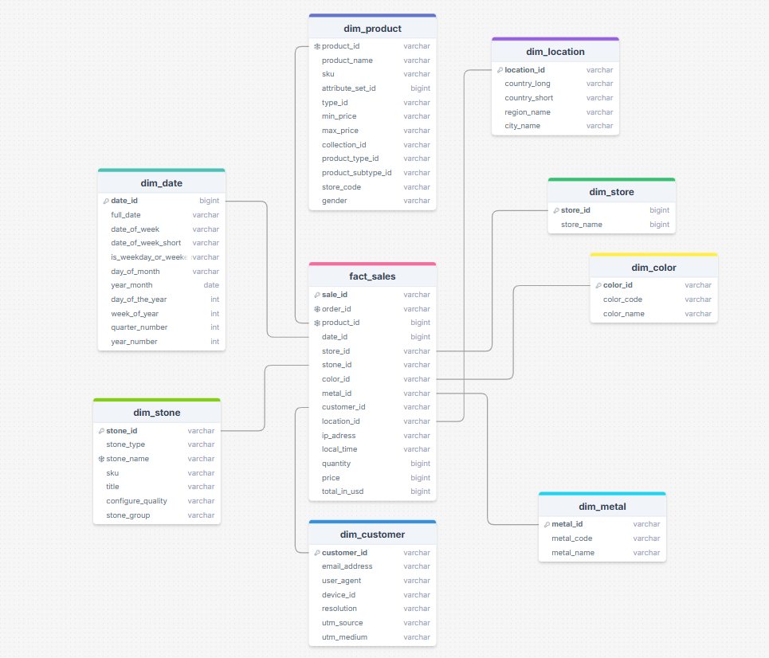
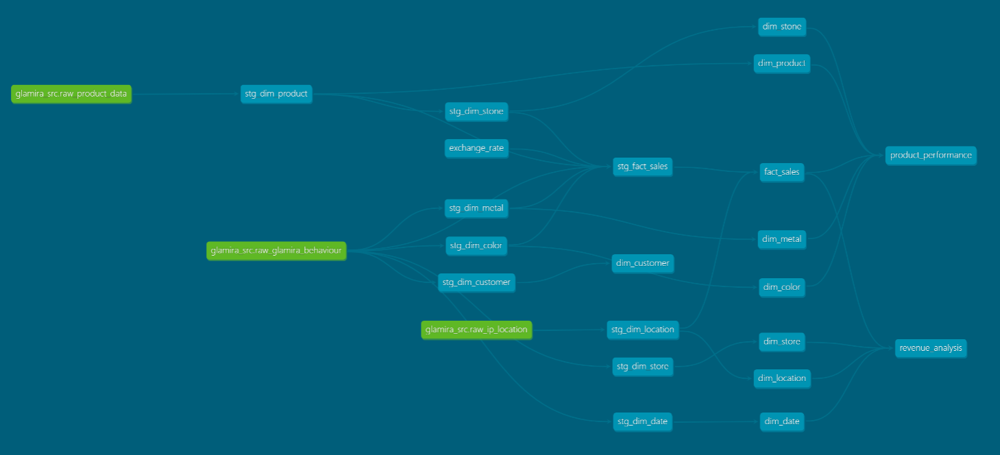

# Welcome to your glamira dbt project!

## Data Transformation
### ❓ Problem Description
Based on the data in Bigquery raw_layer
- Transform data by using **dbt tools**
- Data modeling with dimension_tables creation, fact_table creation
- Including 2 layer for cleaning, normalizing data: staging layer and analysis layer

### 🎯 Learning Objectives
- Understanding dimensional modeling
- Working with dbt

### 📋 Preparation

#### **dbt Setup**
**1. BigQuery**
- Go to https://console.cloud.google.com/, create a project (if you do not have)
- Create a **Service Account** in your project, grant `BigQuery Admin` role for this Service Account
- Add key as Json and download key file

**2. dbt**
- Install VS Code
- Install all necessary dbt libraries in `requirements.txt` by yourself and refer to these links and videos

  - [BigQuery setup | dbt Developer Hub](https://docs.getdbt.com/docs/core/connect-data-platform/bigquery-setup)
  - [How to Install DBT and Set Up a Project, Create Your First dbt Model](https://www.youtube.com/watch?v=1fY1A8SRflI&list=PLmjYN_euFZ0Ye73B_m87guD5amkQB37BL&index=2)
  - [Setup local dbt development environment with dbt-core and VSCode](https://www.youtube.com/watch?v=1fY1A8SRflI&list=PLmjYN_euFZ0Ye73B_m87guD5amkQB37BL&index=2)
  - [DBT Guides](https://docs.getdbt.com/guides)

**3. VS Code**
- Open your project folder
- Install `dbt Power User` extension
- config your `profile.yml` file similar to this
```
dec_project2:
  outputs:
    dev:
      dataset: --Name-of-your-dataset
      job_execution_timeout_seconds: 300
      job_retries: 1
      keyfile: Path-to-your-service-account-file
      location: US
      method: service-account
      priority: interactive
      project: --Your-project-id
      threads: 4
      type: bigquery
  target: dev
```
- Install virtual environment
- Install suitable Python libraries
- Install dbt libraries

### 📝 Tasks
#### **1. Data modeling**


#### **2. Transform data in raw layer into staging layer**
- Based on option.option_label = 'alloy', extract metal code and color code
  - Color code: all characters before "-"
  - Metal code: all characters after "-"
- Since products are crawled with various suffix (country - language)
  - 1st priority: english_product_name (price contains "$")
  - 2nd priority: other_latin_product_name (name with only latin characters)
  - With remaining products, pick randomly one domain
- With stg_fact_sales
  - Either column alloy or column color contain color_id and metal_id, so we need to check both. If it is not null and exists in stg_dim_color/ metal, so we include it
  - Getting exchange rate to ensure that all price is in the same format ($)
#### **3. Transform data in staging layer into analysis layer**
- Create file `generate_schema_name.sql` in macros to avoid concatenating dataset names
- Transform data in staging layer in order to ensure they are same with data model
#### **3. Mapping data to create glamira mart layer for visualizing**
- Queries and create table in mart_layer for later visualization on Looker

### 🖼 Data Lineage dbt flow
